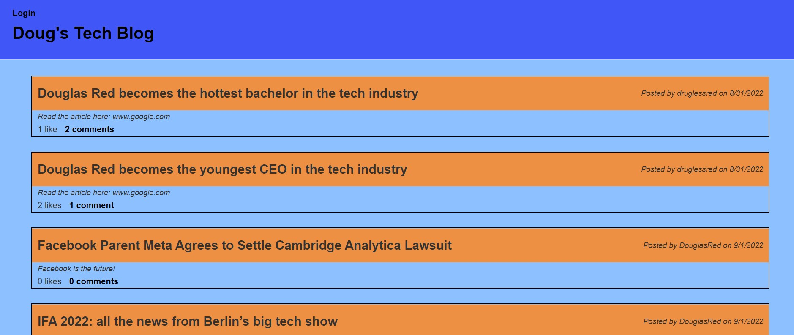

# dougs-tech-blog

## Table of Contents

- [Project Description](#Description)
- [Installation](#Installation)
- [Usage](#Usage)
- [GitHub](#GitHub)
- [Contact Me](#ContactMe)
- [View My Video](#ViewMyVideo)

## Description

### Motivation for creating this project

I built this platform because I wanted to share exciting news in the Tech industy that I thought other would find interesting along with my own personl experiences

### What problem does this solve?

This application will let users share posts, news and stories with each other in a safe and secure way.

## Installation

In order to download and use my code, you will have to clone my repo and install express, sequelize mysql2, handlebars, express-session, express-handlebars, connect-session-sequelize bcrypt and dotenv.After downloading my code just run "npm install" for a speedy installation.

## Usage

Keep up to date with all of the latest news stories with your friends families and associates. This will allow you to allows be in the "know" in an eventful world.

## Contact Me

See other projects I have created at https://github.com/DouglasRed

Contact me at douglasred63@yahoo.com for any questions you have about my project.

## View My Video

View my video of this project here https://youtu.be/fCW_3l91V4M on youtube. The link is required to view the video.

Visit my application on Heroku at https://dougs-tech-blog.herokuapp.com/
